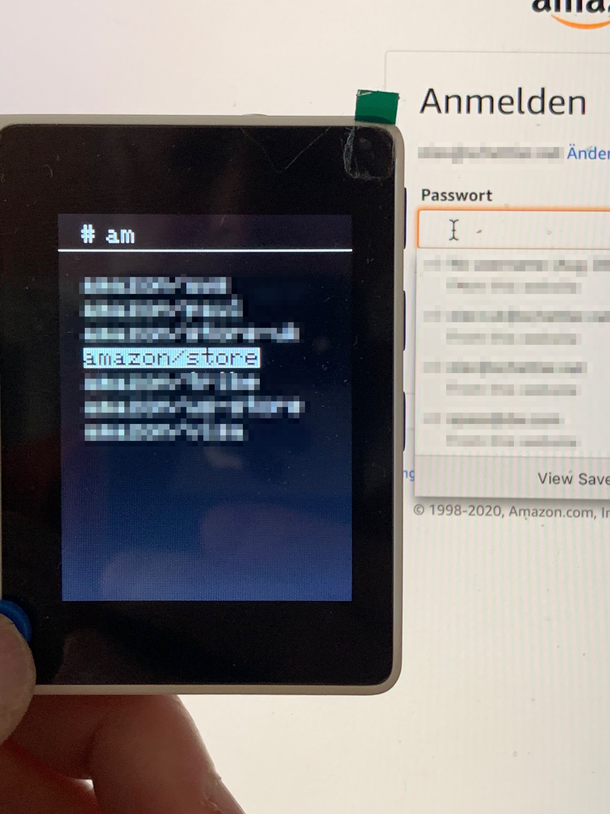
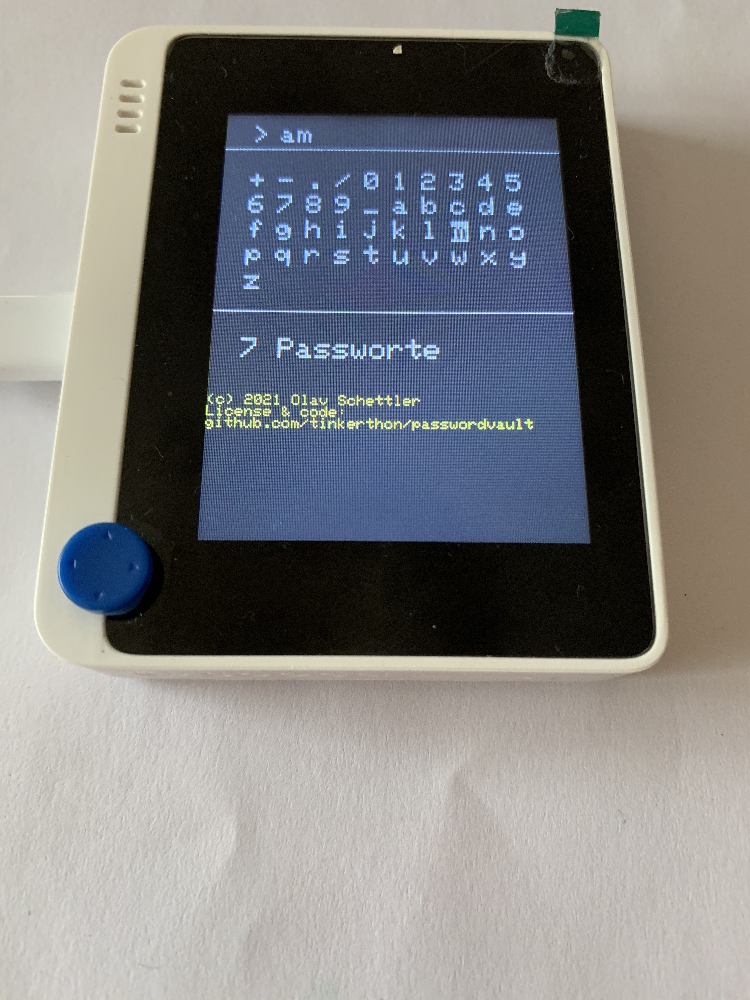
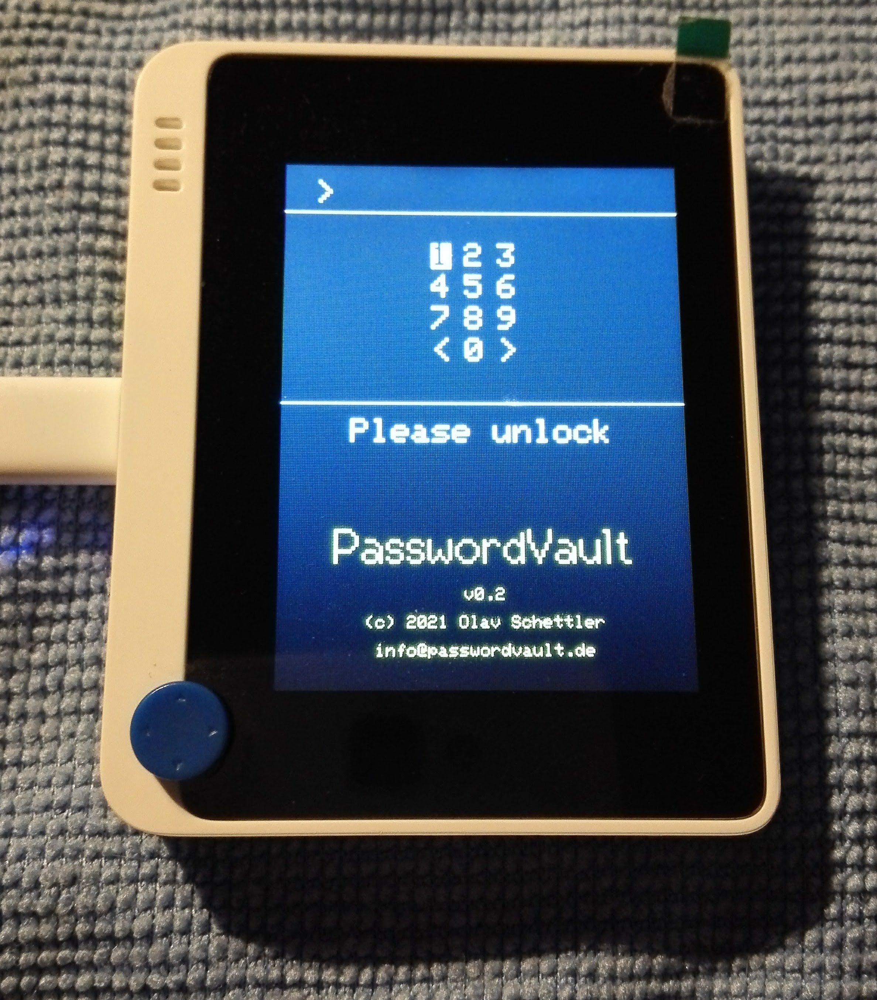
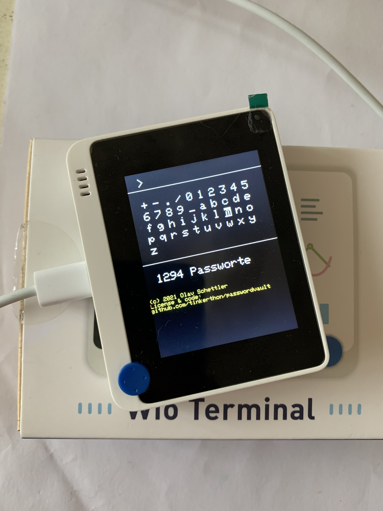

# Password Vault

Have your Wio Terminal type your passwords.



This sketch for the [Seeed Wio Terminal (affiliate link)](https://amzn.to/3qARCI7) reads a list of encrypted passwords from a file "/crypted.txt" on the SD card and displays them on the screen of a Wio Terminal.

Once you have unlocked the software by keying in your master passcode, you can select an entry from the list by filtering and browsing with the 5-way joystick of the Wio Terminal. A password entry is selected by pressing the 5-way joystick. 



The password is then typed to your computer by emulating a keyboard. This works for Windows, macOS, Linux, RaspberryPi and even on iPads. 

You switch between filter and list views by pressing the leftmost button.

For a more detailed account of the PasswordVault's usage, please check out [our wiki](https://github.com/PasswordVault/passwordvault/wiki/PasswordValue-Documentation.-Start-here!).

The passwords are stored encrypted with the XXTEA algorithm. A simple python script is provided to create a file with encrypted passwords. 

## How to prepare the password file

I use https://www.passwordstore.org/ to manage my passwords. There is a simple Python script `passwords.py` to export these passwords into a file that PasswordVault can read. 

To export your passwords, first install the dependencies into a virtual Python environment, then simply run it:

````
python3 -m venv env
source env/bin/activate
pip install -r requirements.txt
python3 passwords.py > passwd
````

ATTENTION: At this point, the passwords are stored in clear text. Don't leave the file `passwd` lying around.

The next step is to encrypt the passwords. For this, you need a file with a master password. As this is also used to unlock the device, you can only use up to eight numbers as master password. Copy file env.example to a file named `.env` and set a passwords from up to eight digits. 

Now, run the encrypter:

````
python3 encrypt.py
````

Copy the resulting file `crypted` to an SD card (formatted as FAT-16), as `crypted.txt`.

In case your are not using `pass`, there now is [an example](https://github.com/tinkerthon/passwordvault/issues/1#issuecomment-762665404) on how to manually create a password file and encrypt it. 

Once you connect the Wio Terminal to a computer, you are greeted with a lock screen. Key in your master password and confirm with `>`.



## Other options

There are many commercial password managers. However, they are expensive, have tiny screens and too few buttons to be comfortably usable. Here are some examples:

* [Password Vault](https://hackaday.io/project/18763-password-vault) by mwahid manages upt to four passwords 
* [Hardware password manager](https://hackaday.io/project/5588-hardware-password-manager) by Voja Antonic manages up to eight passwords
* [CQKey - hardware password keeper](https://hackaday.io/project/11190-cqkey-hardware-password-keeper) has a small display and manages up to 10 passwords
* [Automated Password Typer](https://create.arduino.cc/projecthub/mPelectronic/automated-password-typer-c19017) based on an ATmega with small screen and rotary switch 
* [Password Vault by John N Hansen (affiliate link)](https://amzn.to/3sAGlZQ) with small display and full keyboard
* [Mooltipass](https://www.themooltipass.com/) with small screen and NFC card reader
 
There is even [a paper notebook (affiliate link)](https://amzn.to/3qnLjHu), specifically to keep passwords. Don't loose it :)

Here are [more examples](https://hackaday.io/search?term=password+vault) on Hackaday.

## Why this solution

This PasswordVault is open source and uses open, powerful hardware. The [Wio Terminal by Seeed (affiliate link)](https://amzn.to/3sxrIGJ) is inexpensive (about 39€), has a big screen, 5-way joystick and additional buttons. In even has WiFi and Bluetooth, so there is plenty room for more powerful features in the future.



## What's planned for the future

We are planning the next release [on Github](https://github.com/tinkerthon/passwordvault/projects/1)

LICENSE: GNU GENERAL PUBLIC LICENSE, Version 3
